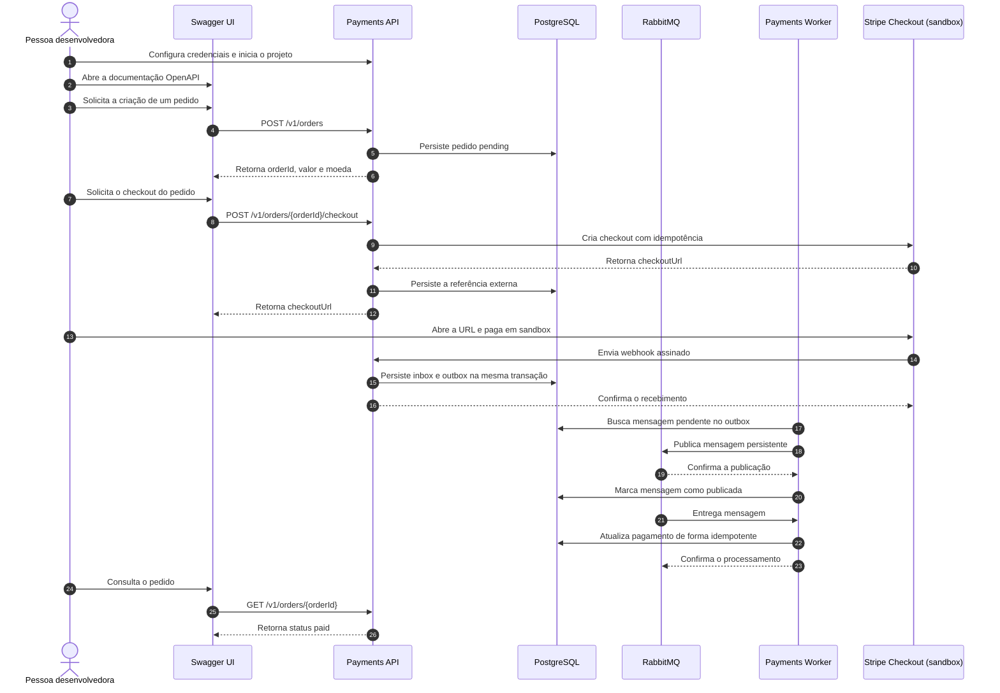

# Payments Boilerplate

API boilerplate open source para integrar pagamentos de forma segura, previsível
e reutilizável.

O projeto é uma API headless escrita em Go que já cria pedidos com preço
calculado no servidor e abre Stripe Checkout hospedado em sandbox. O contrato
OpenAPI e o Swagger UI formam sua interface de demonstração. A confirmação por
webhook e o processamento assíncrono durável com PostgreSQL e RabbitMQ serão
implementados na Fase 3. O projeto não é um gateway, uma instituição financeira
nem um sistema que captura ou armazena dados completos de cartão.

> [!IMPORTANT]
> As Fases 0, 1 e 2 estão concluídas, mas ainda não existe uma versão pronta para
> produção. O uso deste código não garante conformidade com PCI DSS, LGPD ou
> qualquer outra obrigação regulatória.

## Estado atual e roadmap

Este quadro é apenas um resumo. O checklist completo e sua ordem de execução
ficam em [docs/roadmap.md](docs/roadmap.md), que é a fonte de verdade.

| Etapa | Estado | Resultado principal |
| --- | --- | --- |
| Fase 0 — Definições de fundação | Concluída | Visão, limites, decisões técnicas e convenções |
| Fase 1 — Fundação executável | Concluída | API, banco, migrations, observabilidade, CI e deploy documentado |
| Fase 2 — Primeiro pagamento vertical | Concluída | API key, pedido idempotente, consulta e Stripe Checkout em BRL |
| Fase 3 — Confirmação assíncrona confiável | Em andamento | Webhook, inbox/outbox, relay e consumer entregues; inspeção e Pix pendentes |
| Fase 4 — Qualidade para publicação | Planejada | Hardening, testes de falha, métricas e guias operacionais |

Um pagamento concluído na Stripe agora chega ao estado local: o webhook
verificado é gravado na inbox, publicado pelo relay e aplicado pelo consumer,
que move tentativa, pagamento e pedido em uma única transação. Nenhuma URL de
retorno altera estado.

## Desenvolvimento local

Pré-requisitos:

- Go 1.26 ou 1.27;
- Docker com Docker Compose;
- Make, opcional, para os atalhos documentados;
- uma conta Stripe com chave secreta de teste (`sk_test_...`) para abrir o
  checkout real.

Prepare a configuração e as dependências:

```bash
cp .env.example .env
openssl rand -hex 32
make infra-up
make migrate-up
make generate
```

Copie a saída do `openssl` para `INTEGRATION_API_KEYS` no `.env`. A variável
aceita uma ou mais chaves separadas por vírgula para permitir rotação. Cada
chave deve ter ao menos 32 caracteres; use o comando acima para gerar 256 bits
aleatórios em vez de inventar uma senha.

Copie também uma chave secreta do modo de teste da Stripe para
`STRIPE_SECRET_KEY`. As URLs de sucesso e cancelamento da `.env.example` voltam
à documentação local e podem ser substituídas pelas páginas do seu frontend.

Execute API e worker em terminais separados:

```bash
make run-api
make run-worker
```

O processo `worker` publica seu healthcheck e executa dois componentes: o relay
do outbox, que declara a topologia do RabbitMQ e publica as mensagens gravadas
pela API, e o consumer, que as aplica com ack manual, concorrência limitada,
retry com backoff e dead-letter queue.

A API fica disponível em `http://localhost:8080`, a documentação em
`http://localhost:8080/docs/` e o painel local do RabbitMQ em
`http://localhost:15672`.

Valide a API sem abrir o navegador:

```bash
curl --fail --show-error http://localhost:8080/health
curl --fail --show-error http://localhost:8080/openapi.yaml
```

Escolha uma das chaves configuradas para os comandos seguintes:

```bash
export API_KEY='<a-mesma-chave-gravada-em-INTEGRATION_API_KEYS>'
```

Crie um pedido de demonstração. O valor vem do catálogo do servidor, nunca da
requisição (copie o campo `id` da resposta):

```bash
curl --fail --show-error http://localhost:8080/v1/orders \
  -H 'Content-Type: application/json' \
  -H "X-API-Key: $API_KEY" \
  -H "Idempotency-Key: $(uuidgen)" \
  -d '{"productId":"product_demo","quantity":1}'
```

Use esse identificador para criar o checkout:

```bash
export ORDER_ID='ord_...'
curl --fail --show-error -X POST \
  "http://localhost:8080/v1/orders/$ORDER_ID/checkout" \
  -H "X-API-Key: $API_KEY" \
  -H "Idempotency-Key: $(uuidgen)"
```

Abra a `checkoutUrl` retornada e pague no sandbox com `4242 4242 4242 4242`,
uma data futura e qualquer CVC. Consulte o estado local com:

```bash
curl --fail --show-error \
  "http://localhost:8080/v1/orders/$ORDER_ID" \
  -H "X-API-Key: $API_KEY"
```

O pagamento é concluído na Stripe, o webhook registra o evento de forma durável,
o relay publica a mensagem no RabbitMQ e o consumer aplica a transição: o pedido
chega a `paid` e o pagamento a `succeeded`. A página de retorno nunca confirma
pagamento; somente o evento verificado altera estado.

Para incluir o ambiente de observabilidade:

```bash
docker compose --profile observability up -d
```

O Grafana fica disponível em `http://localhost:3000`. Consulte a
[estrutura do projeto](docs/project-structure.md) para entender as fronteiras
dos pacotes.

Os mesmos processos podem ser executados inteiramente em containers:

```bash
docker compose --profile app up --build
```

## Objetivos

- Reduzir o tempo necessário para integrar um primeiro pagamento.
- Demonstrar padrões seguros para checkout, webhooks e idempotência.
- Separar as regras de negócio dos detalhes do provedor de pagamentos.
- Oferecer uma API executável, contrato OpenAPI, testes e documentação
  suficientes para que outra pessoa consiga adaptar o projeto.
- Tornar falhas, retries e mudanças de estado explícitos e auditáveis.

## Escopo da versão 0.1

O objetivo da versão `0.1.0` é deliberadamente pequeno:

- Pagamento único para comércio eletrônico.
- Uma moeda inicial: BRL.
- Um único provedor: Stripe.
- Stripe Checkout hospedado, inicialmente para cartão em BRL.
- Confirmação do resultado por webhook verificado.
- Persistência de pedidos, pagamentos, tentativas e eventos.
- Proteção contra requisições e eventos duplicados.
- Transactional outbox para publicação confiável de mensagens.
- Processamento assíncrono com RabbitMQ e worker idempotente.
- Swagger UI, exemplos de requisição e ambiente de testes/sandbox.

Um frontend próprio, autenticação de consumidor e painel administrativo não
fazem parte do MVP.

Assinaturas, marketplaces, split, repasses e múltiplos provedores não fazem
parte da primeira versão.

Cada instalação atende um único integrador e usa seu próprio banco, conta
Stripe e credenciais. O modelo aprovado exige `X-API-Key` nas rotas de negócio,
mantém health público e autentica webhooks pela assinatura da Stripe. No runtime
atual, `/docs` e `/openapi.yaml` são públicos e o comando `api` os habilita em
todos os ambientes. Desabilitar ou proteger essa documentação fora do ambiente
de desenvolvimento permanece planejado para a Fase 4. A API aceita mais de uma
chave ativa para rotação e responde `401 Unauthorized` sem distinguir chave
ausente de inválida.

## Jornada da pessoa desenvolvedora

A pessoa usuária deste projeto é quem desenvolve o sistema que venderá o produto
ou serviço. No MVP, o Swagger UI ocupa o lugar do sistema que futuramente
consumirá a API.

O diagrama abaixo representa o fluxo-alvo da versão `0.1.0`. A parte entre o
webhook da Stripe e o retorno local `paid` pertence à Fase 3 e ainda não faz
parte do runtime atual.



Em uma integração real, o sistema da pessoa desenvolvedora fará as chamadas que
o Swagger UI representa no diagrama.

## Princípios

1. A aplicação é dona do pedido; o provedor executa o pagamento.
2. O navegador não é uma fonte confiável para confirmar o pagamento.
3. Toda operação monetária que possa ser repetida deve ser idempotente.
4. Webhooks podem ser duplicados, atrasados e entregues fora de ordem.
5. Valores monetários são inteiros na menor unidade da moeda, nunca `float`.
6. Nenhum endpoint próprio recebe PAN, CVV ou dados completos de cartão.
7. Secrets e dados sensíveis nunca são enviados ao cliente ou gravados em logs.
8. Segurança e observabilidade fazem parte do produto, não são complementos.
9. Mensagens podem ser entregues mais de uma vez; seus efeitos são idempotentes.
10. Nenhuma publicação depende de uma escrita simultânea e não transacional no
    banco e no broker.

## Tecnologias do MVP

| Responsabilidade | Escolha |
| --- | --- |
| Linguagem | Go |
| Servidor HTTP | `net/http` |
| Contrato da API | OpenAPI contract-first |
| Geração de código | `oapi-codegen` strict server |
| Banco de dados | PostgreSQL |
| Acesso ao banco | `pgx` + GORM; `sqlc` reservado para SQL crítico explícito |
| Mensageria | RabbitMQ |
| Confiabilidade de publicação | Transactional outbox |
| Provedor | Stripe Checkout hospedado |
| Logs | Zap |
| Métricas e traces | OpenTelemetry |
| Empacotamento local | Docker Compose |

## Documentação

- [Visão e escopo](docs/product-vision.md)
- [Arquitetura](docs/architecture.md)
- [Contrato da API](docs/api.md)
- [Integração com Stripe](docs/providers/stripe.md)
- [Convenções do projeto](docs/conventions.md)
- [Fluxo de encerramento de entregas](docs/delivery-workflow.md)
- [Versionamento](docs/versioning.md)
- [Métricas prioritárias](docs/metrics.md)
- [Roadmap](docs/roadmap.md)
- [Estrutura e responsabilidades dos diretórios](docs/project-structure.md)
- [Deploy na Railway](docs/deployment/railway.md)
- [Decisão arquitetural: limites do produto](docs/decisions/0001-project-boundaries.md)
- [Decisão arquitetural: API headless](docs/decisions/0002-headless-api.md)
- [Decisão arquitetural: Go e RabbitMQ](docs/decisions/0003-go-rabbitmq.md)
- [Decisão arquitetural: licença](docs/decisions/0004-apache-license.md)
- [Decisão arquitetural: convenções, versionamento e suporte](docs/decisions/0005-conventions-versioning-support.md)
- [Decisão arquitetural: Stripe como primeiro provedor](docs/decisions/0006-stripe-first-provider.md)
- [Decisão arquitetural: GORM e sqlc](docs/decisions/0007-gorm-and-sqlc.md)
- [Decisão arquitetural: Zap e OpenTelemetry](docs/decisions/0008-observability-stack.md)
- [Decisão arquitetural: Railway](docs/decisions/0009-railway-deployment.md)
- [Decisão arquitetural: acesso às rotas](docs/decisions/0010-route-access-model.md)
- [Guia de contribuição](CONTRIBUTING.md)
- [Política de suporte](SUPPORT.md)
- [Changelog](CHANGELOG.md)
- [Política de segurança](SECURITY.md)

## Estado das decisões

| Tema | Estado |
| --- | --- |
| API de referência, não processador | Decidido |
| Produto headless com OpenAPI/Swagger UI | Decidido |
| Frontend próprio no MVP | Não terá |
| Linguagem | Go |
| Processamento assíncrono | RabbitMQ desde a versão 0.1 |
| Persistência e outbox | PostgreSQL |
| Primeiro fluxo: pagamento único | Decidido |
| Moeda inicial: BRL | Decidido |
| Checkout hospedado | Decidido |
| Primeiro provedor | Stripe Checkout |
| Meio inicial | Cartão em BRL; Pix após validar o fluxo assíncrono |
| Modelo de implantação | Um integrador por instalação |
| Acesso às rotas de negócio | API key do integrador |
| Licença open source | Apache-2.0 |
| Versionamento | SemVer; série `v0.x` experimental |
| Commits e pull requests | Conventional Commits + squash merge |
| Suporte durante `v0.x` | Minor mais recente, melhor esforço, sem SLA |
| Público principal | Pessoas desenvolvedoras e equipes de software |

## Versionamento e suporte

A primeira entrega funcional será `v0.1.0`. Durante a série `v0.x`, versões
minor podem conter mudanças incompatíveis e somente a minor mais recente recebe
correções em melhor esforço. Consulte as políticas completas de
[versionamento](docs/versioning.md) e [suporte](SUPPORT.md).

## Licença

Código, documentação e exemplos são distribuídos sob a
[Apache License 2.0](LICENSE). Ela permite uso, modificação e distribuição,
inclusive comercial, de acordo com suas condições. O software é fornecido sem
garantias; consulte o texto completo da licença.

## Referências de segurança

- [PCI Security Standards Council — PCI DSS](https://www.pcisecuritystandards.org/standards/pci-dss/)
- [OWASP Application Security Verification Standard](https://owasp.org/www-project-application-security-verification-standard/)
- [ANPD — materiais educativos e publicações](https://www.gov.br/anpd/pt-br/centrais-de-conteudo/materiais-educativos-e-publicacoes)
